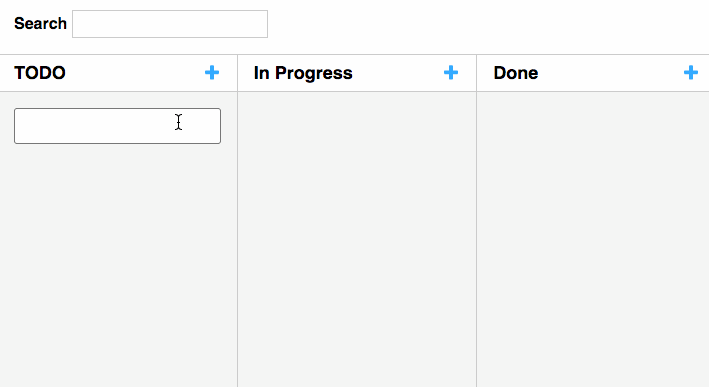

# Kanban

Project based on React/Redux architeture and Webpack for bundling.

## Demo



## Try it out

1. Clone this project

```
git clone git@github.com:ivanbanov/kanban.git
```

2. Install all dependencies

```
npm install
```

3. Run the dev server

```
npm start
```

Then access [http://localhost:8080/](http://localhost:8080/)

## Features

- Drag and drop for tasks
- Task box with autosize
- Persistent data
- Search for tasks
- [StyledComponents](https://www.styled-components.com/) to handle the UI
- [ReduxActions](https://redux-actions.js.org/) to handle action creators
